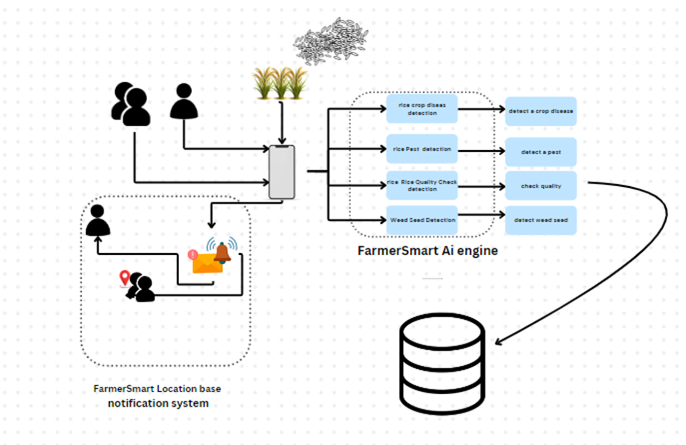

# FarmerSmart: AI-Driven Agriculture Assistance

## Project Overview

FarmerSmart is a mobile application designed to support farmers in improving crop management and increasing productivity. By leveraging AI, the app offers real-time solutions for disease and pest detection, seed identification, and rice quality assessment. It also facilitates communication between farmers and agricultural experts, ensuring timely interventions. The system is built with the goal of promoting sustainable farming practices, increasing awareness, and improving overall crop yield.

## System Overview

### **System Architecture**
The system is divided into three main layers:

1. **Client Tier (Mobile Application)**  
   The front-end is developed using **React Native**, providing a seamless user interface for both farmers and agricultural experts on Android and iOS platforms.

2. **Middle Tier (Backend API)**  
   The back-end is built using **Python Flask**, handling all API requests, processing images, implementing machine learning models, and managing notifications.

3. **Data Tier (Database)**  
   The app uses **MySQL** to store key data, such as user profiles, disease and pest solutions, seed information, and communication logs between farmers and experts.

### **Key Modules and Features**

#### 1. **Disease Detection**
   - **Description**:  
     Disease detection is powered by machine learning, specifically using Convolutional Neural Networks (CNNs). Farmers can upload images of their crops, and the system automatically analyzes the images to detect common plant diseases in real time.
   
   - **Functionality**:  
     - Upload crop images via the app.
     - The CNN model processes the images and identifies any diseases present.
     - A tailored solution, including treatment suggestions and preventive measures, is provided.
     - The solution is instantly displayed on the app.
   
   - **Value**:  
     - Helps farmers detect diseases at an early stage, preventing large-scale crop loss.
     - Provides actionable solutions to treat and manage diseases efficiently.

#### 2. **Pest Detection**
   - **Description**:  
     Similar to disease detection, the pest detection feature allows farmers to upload images of their crops to identify pests that may be damaging their fields.
   
   - **Functionality**:  
     - The system processes the uploaded images to identify pests based on visual patterns.
     - A list of recommended actions for pest control is displayed to the farmer, including pesticide recommendations and organic solutions.
     - Notification alerts are sent to nearby farmers and agricultural experts if an outbreak is detected.
   
   - **Value**:  
     - Increases crop protection by identifying pests before they cause significant damage.
     - Encourages early intervention and minimizes pesticide usage by suggesting more sustainable alternatives when possible.

#### 3. **Wide Seed Identification**
   - **Description**:  
     This feature focuses on identifying weed seeds that can negatively impact crop growth. Farmers can upload images of unidentified seeds, and the system will identify them and offer solutions for management and eradication.
   
   - **Functionality**:  
     - Farmers upload images of seeds found in their fields.
     - The system identifies the seed type (weed or crop-related) and provides specific recommendations on how to manage or remove it from the field.
     - Guidance on herbicides or natural alternatives is given based on the type of weed identified.
   
   - **Value**:  
     - Helps farmers manage unwanted weed growth that competes with crops for nutrients.
     - Increases efficiency in field management by providing solutions for weed control and preventing crop loss.

#### 4. **Rice Quality Check**
   - **Description**:  
     After harvesting, farmers can assess the quality of their rice using image-based analysis. The system provides a visual inspection to grade rice quality based on certain parameters like size, shape, and color.
   
   - **Functionality**:  
     - Farmers upload images of their harvested rice.
     - The system processes the images and analyzes the quality based on predefined quality parameters (e.g., grain size, color, damage).
     - A quality grade is displayed, helping farmers determine market value and whether the rice is suitable for sale or requires further processing.
   
   - **Value**:  
     - Increases the value of the farmer's crops by providing accurate assessments of rice quality.
     - Allows farmers to make informed decisions about how to sell or process their harvest for the best price.

#### 5. **Real-Time Notification System**
   - **Description**:  
     The real-time notification system helps keep farmers informed about any urgent matters, such as disease outbreaks, pest infestations, or new updates from agricultural experts.
   
   - **Functionality**:  
     - Farmers and agricultural experts receive push notifications about important updates in real time.
     - Notifications are sent through **Firebase Cloud Messaging (FCM)**, alerting users to potential crop issues, such as detected pests or diseases.
     - Users can adjust notification settings to receive alerts based on their preferences.
   
   - **Value**:  
     - Ensures timely intervention by keeping farmers and experts informed of critical situations.
     - Enhances the efficiency of communication between farmers and agricultural experts, reducing response times to potential threats.

## Technologies Used

### **Frontend (Client Tier)**
- **React Native**: A cross-platform framework for building mobile applications that run on both Android and iOS.

### **Backend (Middle Tier)**
- **Python Flask**: A micro web framework for building RESTful APIs, processing requests, handling machine learning models, and managing notifications.

### **Database (Data Tier)**
- **MySQL**: A relational database for storing user data, disease/pest solutions, seed information, and communication logs.

### **Machine Learning and AI**
- **Convolutional Neural Networks (CNNs)**: Used for real-time disease and pest detection by analyzing crop images.

### **Notifications**
- **Firebase Cloud Messaging (FCM)**: A service for sending push notifications to alert farmers and experts about disease outbreaks, pest issues, or new updates.

## Installation

### Prerequisites
- **Node.js** (for React Native)
- **Python 3.x** (for Flask API)
- **MySQL Database** (for storing data)

# License

This project is licensed under the [MIT License](LICENSE).
